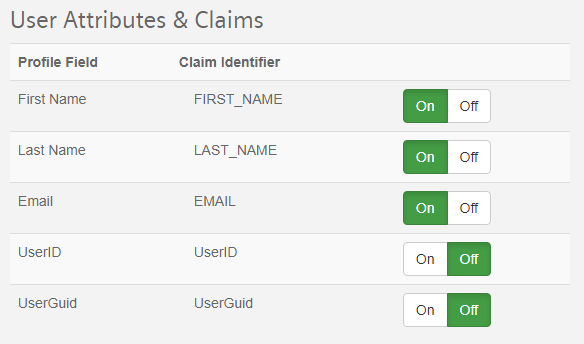
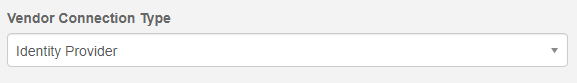
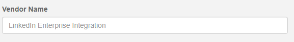
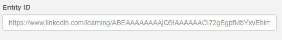
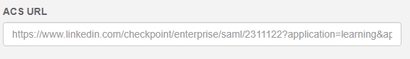
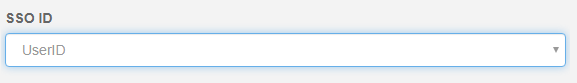

# Administering Single Sign-On as an Identity Provider

This guide is for administrators to help guide them through the process of setting up SAML in the role of the Identity Provider.

Security Assertion Markup Language (SAML) is an open standard for exchanging authentication and authorization data between providers, in particular, between an Identity Provider (IdP) and a Service Provider (SP).

In the case discussed in this document, PEPconnect will act as the IdP and the 3rd party system will be the SP.

## SAML Flow

The IdP and the SP do not talk directly but use the browser to broker the authentication flow. The diagram below illustrates this concept.

*Source: [Okta](https://www.okta.com/integrate/documentation/saml/)*

To make the connection, we will use SAML 2.0 as the protocol for exchanging information between the two providers.

By default, the IdP and SP will use HTTP POST to redirect and transmit data between each other.

## Flow Initiation

When a user initiates flow at the Identity Provider (IdP), the IdP redirects the user to the Primary Service Provider's (SP) URL after successful authentication.

When a user initiates flow at the Service Provider (SP), the SP will determine if the user has a valid session with the system. In case the session is invalid or expired, the SP will redirect a user to IdP to authenticate. One of the use cases in this scenario is where a user begins the flow at a URL somewhere inside the application. When a user comes back to SP, they will land on the same page instead of the SP's primary URL. This is accomplished using a parameter called RelayState. The 3rd Party will set this value before redirecting the user to IdP, and when a user is returned after successful authentication, it will take the user to that URL.

## Sign Up vs. Sign in Flow

When a user uses SAML to authenticate into a 3rd party, the sign-in and sign-up cases will follow a similar flow.

After the user has authenticated via the IdP, they will be able to access the SP.  If the user were redirected to the IdP via login from the SP, they would be redirected back to the SP.  Otherwise, if they initiate the flow at the IdP, they should be sent to the same URL directly.

The IdP will pass back user authentication and profile data via SAML. The 3rd Party will validate the digital signature associated with the IdP to make sure the data is sent by the proper IdP. Once that is confirmed, the 3rd Party will read the profile information sent. The profile information will contain at the very least, a field that uniquely identifies the user. The IdP will configure this field as the SSO ID, and this can be the user's e-mail address, GUID, or User ID. The profile data will also include other mandatory and optional fields like user's name, e-mail address, etc.

The 3rd Party will then determine if the user already exists in the system using the SSO ID. If it is a new user, the 3rd Party will use the profile data to set up their profile in the system. The user will then be sent to a new user flow.

If the user already exists, the 3rd Party will still use the profile data to update any changes to the user's profile. It will then log in the user.

In both cases, the user is authenticated into the 3rd Party, which will be valid for the life of the session. If the user were to come to the 3rd Party directly with a valid session, the user would be logged in without going through the SAML sign-in flow.

## Field Mapping

IdP may pass fields differently than what is expected by 3rd Party. For example, the IdP may call the first name field first_name, while the 3rd Party may call it firstName. This will be handled by the 3rd Party using field mapping. When configuring SAML, the admin will be able to set up field mapping, where they can designate first_name to map to firstName. This will ensure that the profile data is updated correctly in the 3rd Party.

Available fields for mapping and their SAML identifiers are as follows:

**Note:** The field identified as the SSO ID will not be included in the list of claims by default but can be enabled separately as a claim.

## Change Password and Logout

Since the 3rd Party is not the authentication authority, both Change Password and Logout will be handled by IdP.  This functionality is not currently implemented within PEPconnect for the SP to pass users to direct pages for changing their passwords or logging out.  Once provided, however, the 3rd Party may optionally implement the URLs for both of these functions.

For Change Password, the 3rd Party will provide verbiage that the user needs to change their password within the IdP and optionally provide links to redirect back to the IdP.  When PEPconnect has implemented the Change Password URLs, then the 3rd Party can optionally redirect the user to that endpoint. This will not affect the user's current session with the system.

For Logout, the 3rd Party will clear the user's current session and then redirect the user back to PEPconnect.  Once implemented, they optionally can pass the user to the IdP provided logout URL.

## Profile Editing

The profile fields that are sent by the IdP will not be editable in the 3rd Party. This is to avoid merging and conflicts in profile data. The user will be shown a message that these fields need to be updated on the IdP end.

## Configuring SAML

For SAML to work correctly, a configuration is needed at both ends. The following information will need to be exchanged between IdP and SP:

1. **IdP Login URL:** This is the endpoint on the IdP where the 3rd Party will post-authentication requests.  The IdP will provide this.
2. **SP Login URL:** Sometimes referred to as the ACS Url, this is the primary URL for the 3rd Party that will be provided to the IdP.  The IdP, on successful authentication, will POST profile data back to this URL.
3. **Entity ID:** The IdP and the SP will exchange unique URL identifiers used to verify the sending and receiving identities in the SAML exchange.  The SP will provide their Entity ID to the IdP, and the IdP will provide their Entity ID to the SP.
4. **Certificate:** The IdP will provide an x.509 certificate that the 3rd Party will use to validate all SAML requests sent to it.
5. **SSO Id:** The IdP will pass a unique identifier to the 3rd Party in the `<saml:Subject>` block.  It is the SP's responsibility to link this to a field within the 3rd Party to uniquely identify the user within their system.
6. **Fields and Mapping:** List of fields that the IdP will send as part of the SAML Claims within the `<saml:Attribute>` nodes to be mapped to the internal fields within the 3rd Party.
7. **Change Password URL (Future Implementation):** The URL the SP can open in the case that the user wishes to change their password.  This will be provided optionally by the IdP and is optional for the SP to implement.  If it is not implemented, the 3rd Party should make a reasonable attempt to hide this functionality from the end-user.
8. **Logout URL (Future Implementation):** The URL the SP can open in the case that the user wishes to log out.  This will be provided optionally by the IdP and is optional for the SP to implement.  If it is not implemented, the 3rd Party should make a reasonable attempt to hide this functionality from the end-user.

To set up the IdP connection within PEPconnect, enter the SP provided information and configure the connection as below.  All of these fields are required, so be sure to get this information from the 3rd Party before the initial setup.  This may require them to do a partial set up on their end to facilitate the generation of this information.

* Select "Identity Provider" as the **Vendor Connection Type**.

* Enter a name to describe the 3rd Party in **Vendor Name**.  This name is for informational purposes only to identify this specific connection.

* Enter the **Entity ID** provided to you by the 3rd Party. (Typically, will be in the form of a URL).  This must be entered exactly as the 3rd Party provides it or the systems will refuse to talk to each other.

* Enter the **ACS URL** (sometimes called the SP URL or SP Login URL) provided to you by the 3rd Party.  This is the URL that PEPconnect will send the SAML request to log the user into the 3rd Party.

* Select the field you want to pass as the **SSO ID**.  This is what the 3rd Party will store to map users in PEPconnect to users within their own system.  User ID is preferred as this is an immutable unique identifier (it never changes), but E-mail is provided as an option as well.  Be sure to include E-mail within the claims even if it's selected here as the 3rd Party may not associate the SSO ID with individual profile information within their system.

Once you've entered this information you can provide the downloadable XML you can access from the Vendor Connections grid to the 3rd Party so they can complete their setup as an SP.  An example of this XML is below.  It contains the Entity ID for PEPconnect, IdP login URLs, and the x.509 certificate.

~~~
<EntityDescriptor xmlns:xsd="http://www.w3.org/2001/XMLSchema" xmlns:xsi="http://www.w3.org/2001/XMLSchema-instance" entityID="https://pep-siemens-info.com/" xmlns="urn:oasis:names:tc:SAML:2.0:metadata">
  <IDPSSODescriptor WantAuthnRequestsSigned="false" protocolSupportEnumeration="urn:oasis:names:tc:SAML:2.0:protocol">
    <KeyDescriptor use="signing">
      <KeyInfo xmlns="http://www.w3.org/2000/09/xmldsig#">
        <X509Data>
          <X509Certificate>MIICLjCCAZegAwIBAgIQAP/Gml3vfF51KkqzyoAHPzANBgkqhkiG9w0BAQsFADAdMRswGQYDVQQD
DBJ3d3cudGVzdHZlbmRvci5jb20wIBcNMTkwNTI0MjAxMTIwWhgPMjExOTA1MzEyMDExMjBaMB0x
GzAZBgNVBAMMEnd3dy50ZXN0dmVuZG9yLmNvbTCBnzANBgkqhkiG9w0BAQEFAAOBjQAwgYkCgYEA
jYRnk70CNGVe7QiR9yrlLOmNW4MNEgw+kYZzV0QX0Kj5B9tUbJAOpHOZNWsPNzU7cXez9hCLngUd
cjRYhXhvWc3FSDSHA8YppjNcdWYEwr94nukpSCye4C+9i1FeXjJaslWlSN9OhA/FFDoBb/c9pQ6r
iCOF2gfuA5dv1ZCIwy0CAwEAAaNtMGswVAYDVR0jBE0wS4AU6uy3q/X8O/hFE6aaeu6FlcISyb6h
IaQfMB0xGzAZBgNVBAMMEnd3dy50ZXN0dmVuFG9yLmNvbYIQAP/Gml3vfF51KkqzyoAHPzATBgNV
HSUEDDAKBggrBgEFBQcDATANBgkqhkiG9w0BAQsFAAOBgQB6u1TRYDQb7yZAFZHoroWSraMf5uFa
+ds5QPeQ6G7S0Mk0pHyIAGeINqInI4bmt1au9XvELqzcTXqxIPrCeHHVDEvspCepx+TLqYi34F13
yWeO0IxceXCNYAYBfV6d/p7qXcboX0/UjxdkR5IY1OKcdDtJkzFOG3GFl3ovaHFEqA==
</X509Certificate>
        </X509Data>
      </KeyInfo>
    </KeyDescriptor>
    <NameIDFormat>urn:oasis:names:tc:SAML:2.0:nameid-format:persistent</NameIDFormat>
    <NameIDFormat>urn:oasis:names:tc:SAML:2.0:nameid-format:transient</NameIDFormat>
    <NameIDFormat>urn:oasis:names:tc:SAML:1.1:nameid-format:unspecified</NameIDFormat>
    <NameIDFormat>urn:oasis:names:tc:SAML:1.1:nameid-format:emailAddress</NameIDFormat>
    <NameIDFormat>urn:oasis:names:tc:SAML:2.0:nameid-format:kerberos</NameIDFormat>
    <SingleSignOnService Binding="urn:oasis:names:tc:SAML:2.0:bindings:HTTP-Redirect" Location="https://pep-siemens-info.com/saml/idp/6400e167-6426-4851-940a-97d13703af31" />
    <SingleSignOnService Binding="urn:oasis:names:tc:SAML:2.0:bindings:HTTP-POST" Location="https://pep-siemens-info.com/saml/idp/6400e167-6426-4851-940a-97d13703af31" />
  </IDPSSODescriptor>
</EntityDescriptor>
~~~
