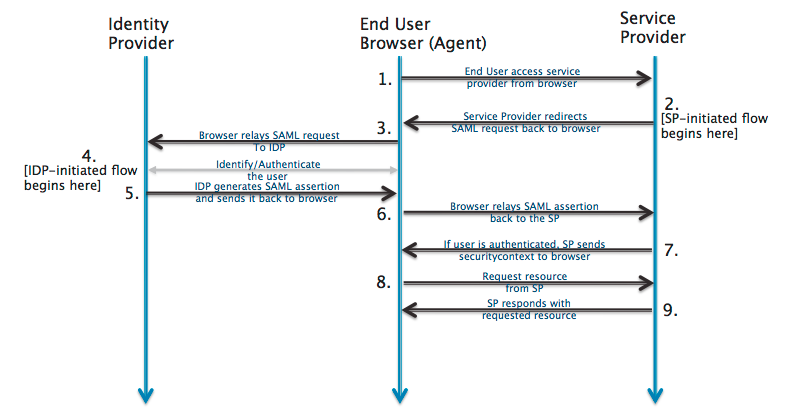

# Single Sign-On with SAML for 3rd Party Service Providers

if you are a 3rd party provider, this guide will help you with connecting to PEP with SAML.

Security Assertion Markup Language (SAML) is an open standard for exchanging authentication and authorization data between providers, in particular, between an Identity Provider (IdP) and a Service Provider (SP).

In the case discussed in this document, PEPconnect will act as the IdP and the 3rd party system will be the SP.

## SAML Flow

The IdP and the SP do not talk directly but use the browser to broker the authentication flow. The diagram below illustrates this concept.


*Source: [Okta](https://www.okta.com/integrate/documentation/saml/)*

To make the connection, we will use SAML 2.0 as the protocol for exchanging information between the two providers.

By default, the IdP and SP will use Http POST to redirect and transmit data between each other.

## Flow Initiation

When a user initiates flow at the Identity Provider (IdP), the IdP redirects user to the primary Service Provider’s (SP) URL after successful authentication.

When a user initiates flow at the Service Provider (SP), the SP will determine if the user has a valid session with the system. In case the session is invalid or expired, the SP will redirect user to IdP to authenticate. One of the use cases in this scenario is where user begins the flow at a URL somewhere inside the app. It would then make sense that when the user comes back to SP, they land at the same page instead of the SP’s primary URL. This is accomplished using a parameter called RelayState. The 3rd party will set this value before redirecting the user to IdP, and when a user is returned back after successful authentication, it will take the user to that URL.

## Sign Up vs. Sign in Flow

When a user uses SAML to authenticate into a 3rd party, the sign in and sign up cases will follow a similar flow.

After the user has authenticated via the IdP, they will be able to access the SP.  If the user was redirected to the IdP via login from the SP they will be redirected back to the SP.  Otherwise if they initiate the flow at the IdP they should be sent to the same URL directly.

The IdP will pass back user authentication and profile data via SAML. The 3rd party will validate the digital signature associated with the IdP to make sure the data is sent by the proper IdP. Once that is confirmed, the 3rd party will read the profile information sent. The profile information will contain at the very least a field that uniquely identifies the user. This field will be configured by the IdP as the Subject and this can be the user’s email address, guid or any other unique id. The profile data will also include other mandatory and optional fields like user’s name, email address, etc.

The 3rd party will then determine if the user already exists in the system using the Subject. If it is a new user, the 3rd party will use the profile data to set up their profile in the system. The user will then be sent to new user flow.

If the user already exists, the 3rd party will still use the profile data to update any changes to the user’s profile. It will then login the user.

In both cases, the user will be authenticated into the 3rd party, which will be valid for the life of the session. If the user was to come to the 3rd party directly with a valid session, the user will be logged in without going through the SAML sign in flow.

## Field Mapping

IdP may pass fields differently than what is expected by 3rd party. For example, the IdP may call the first name field first_name, while the 3rd party may call it firstName.

This will be handled by 3rd party using field mapping. When configuring SAML, the admin will be able to set up field mapping, where they can designate first_name to map to firstName. This will ensure that the profile data is updated properly in the 3rd party.

Available fields for mapping and their SAML identifiers are as follows:

|Profile Field|Claim Identifier|
|-------------|----------------|
|First Name   |FIRST_NAME      |
|Last Name    |LAST_NAME       |
|Email        |EMAIL           |
|User Id      |UserID          |
|User Guid    |UserGuid        |

**Note:** The value identified by the IdP for the Subject will not be included in the list of claims by default but can be passed seperately as a claim.

## Change Password and Logout

Since the 3rd party is not the authentication authority, both Change Password and Logout will be handled by IdP.  This functionality is not currently implemented within PEPconnect for the SP to pass users to direct pages for changing their passwords or logging out.  Once provided however, the URLs for both of these functions may be optionally implemented by the 3rd party.

For Change Password, the 3rd party will provide verbiage that the user needs to change their password within the IdP and optionally provide links to redirect back to the IdP.  When the Change Password Urls have been implemented by PEPconnect then the 3rd party can optionally redirect the user to that endpoint. This will not affect user’s current session with the system.

For Logout, the 3rd party will clear the user’s current session and then redirect the user back to PEPconnect.  Once implmented, they optionally can pass the user to the IdP provided logout URL.

## Profile Editing

The profile fields that are sent by the IdP will not be editable in the 3rd party. This is to avoid merging and conflicts in profile data. The user will be shown a message that these fields need to be updated on the IdP end.

## Configuring SAML

For SAML to work properly, configuration is needed at both ends. The following information will need to be exchanged between IdP and SP:

1. **IdP Login URL:** This is the endpoint on the IdP where the 3rd party will post authentication requests.  This will be provided by the IdP.
2. **SP Login URL:** Sometimes referred to as the ACS Url, this is the primary URL for the 3rd party that will be provided to the IdP.  The IdP, on successful authentication, will POST profile data back to this URL.
3. **Entity ID:** The IdP and the SP will exchange unique URL identifiers used to verify the sending and receiving identities in the SAML exchange.  The SP will provide their Entity ID to the IdP and the IdP will provide their own Entity ID to the SP.
3. **Certificate:** The IdP will provide an x.509 certificate that the 3rd party will use to validate all SAML requests sent to it.
4. **SSO Id:** The IdP will pass a unique identifier to the 3rd party in the `<saml:Subject>` block.  It is the SP's responsibility to link this to a field within the 3rd party to uniquely identify the user within their system.
5. **Fields and Mapping:** List of fields that the IdP will send as part of the SAML Claims within the `<saml:Attribute>` nodes to be mapped to the internal fields within the 3rd party.
6. **Change Password URL (optional):** The URL the SP can open in the case that the user wishes to change their password.  This will be provided optionally by the IdP and is optional for the SP to implement.  If it is not implemented the 3rd party should make a reasonable attempt to hide this functionality from the end user.
7. **Logout URL (optional):** The URL the SP can open in the case that the user wishes to log out.  This will be provided optionally by the IdP and is optional for the SP to implement.  If it is not implemented the 3rd party should make a reasonable attempt to hide this functionality from the end user.

PEPconnect will require the SP Entity ID and SP Login URL in order to begin setup of the SAML integration.  Once that information is provided and PEPconnect has been configured, a metadata file containing the IdP information will be provided to the 3rd party similar to the following example.  This metadata contains the Entity ID for PEPconnect, IdP login URLs, and the x.509 certificate to use when verifying signed requests.

**Using the example below as a reference, the follow respective values would be provided to the SP:**
1. **Entity ID:** https://pep-siemens-info.com/
2. **X509 Certificate:** MIICLjCCAZegAwIBAgIQAP/Gml3vfF51KkqzyoAHPzANBgkqhkiG9w0BAQsFADAdMRswGQYDVQQD
DBJ3d3cudGVzdHZlbmRvci5jb20wIBcNMTkwNTI0MjAxMTIwWhgPMjExOTA1MzEyMDExMjBaMB0x
GzAZBgNVBAMMEnd3dy50ZXN0dmVuZG9yLmNvbTCBnzANBgkqhkiG9w0BAQEFAAOBjQAwgYkCgYEA
jYRnk70CNGVe7QiR9yrlLOmNW4MNEgw+kYZzV0QX0Kj5B9tUbJAOpHOZNWsPNzU7cXez9hCLngUd
cjRYhXhvWc3FSDSHA8YppjNcdWYEwr94nukpSCye4C+9i1FeXjJaslWlSN9OhA/FFDoBb/c9pQ6r
iCOF2gfuA5dv1ZCIwy0CAwEAAaNtMGswVAYDVR0jBE0wS4AU6uy3q/X8O/hFE6aaeu6FlcISyb6h
IaQfMB0xGzAZBgNVBAMMEnd3dy50ZXN0dmVuFG9yLmNvbYIQAP/Gml3vfF51KkqzyoAHPzATBgNV
HSUEDDAKBggrBgEFBQcDATANBgkqhkiG9w0BAQsFAAOBgQB6u1TRYDQb7yZAFZHoroWSraMf5uFa
+ds5QPeQ6G7S0Mk0pHyIAGeINqInI4bmt1au9XvELqzcTXqxIPrCeHHVDEvspCepx+TLqYi34F13
yWeO0IxceXCNYAYBfV6d/p7qXcboX0/UjxdkR5IY1OKcdDtJkzFOG3GFl3ovaHFEqA
3. **IDP Login URL:** https://pep-siemens-info.com/saml/idp/6400e167-6426-4851-940a-97d13703af31

```
<EntityDescriptor xmlns:xsd="http://www.w3.org/2001/XMLSchema" xmlns:xsi="http://www.w3.org/2001/XMLSchema-instance" entityID="https://pep-siemens-info.com/" xmlns="urn:oasis:names:tc:SAML:2.0:metadata">
  <IDPSSODescriptor WantAuthnRequestsSigned="false" protocolSupportEnumeration="urn:oasis:names:tc:SAML:2.0:protocol">
    <KeyDescriptor use="signing">
      <KeyInfo xmlns="http://www.w3.org/2000/09/xmldsig#">
        <X509Data>
          <X509Certificate>MIICLjCCAZegAwIBAgIQAP/Gml3vfF51KkqzyoAHPzANBgkqhkiG9w0BAQsFADAdMRswGQYDVQQD
DBJ3d3cudGVzdHZlbmRvci5jb20wIBcNMTkwNTI0MjAxMTIwWhgPMjExOTA1MzEyMDExMjBaMB0x
GzAZBgNVBAMMEnd3dy50ZXN0dmVuZG9yLmNvbTCBnzANBgkqhkiG9w0BAQEFAAOBjQAwgYkCgYEA
jYRnk70CNGVe7QiR9yrlLOmNW4MNEgw+kYZzV0QX0Kj5B9tUbJAOpHOZNWsPNzU7cXez9hCLngUd
cjRYhXhvWc3FSDSHA8YppjNcdWYEwr94nukpSCye4C+9i1FeXjJaslWlSN9OhA/FFDoBb/c9pQ6r
iCOF2gfuA5dv1ZCIwy0CAwEAAaNtMGswVAYDVR0jBE0wS4AU6uy3q/X8O/hFE6aaeu6FlcISyb6h
IaQfMB0xGzAZBgNVBAMMEnd3dy50ZXN0dmVuFG9yLmNvbYIQAP/Gml3vfF51KkqzyoAHPzATBgNV
HSUEDDAKBggrBgEFBQcDATANBgkqhkiG9w0BAQsFAAOBgQB6u1TRYDQb7yZAFZHoroWSraMf5uFa
+ds5QPeQ6G7S0Mk0pHyIAGeINqInI4bmt1au9XvELqzcTXqxIPrCeHHVDEvspCepx+TLqYi34F13
yWeO0IxceXCNYAYBfV6d/p7qXcboX0/UjxdkR5IY1OKcdDtJkzFOG3GFl3ovaHFEqA==
</X509Certificate>
        </X509Data>
      </KeyInfo>
    </KeyDescriptor>
    <NameIDFormat>urn:oasis:names:tc:SAML:2.0:nameid-format:persistent</NameIDFormat>
    <NameIDFormat>urn:oasis:names:tc:SAML:2.0:nameid-format:transient</NameIDFormat>
    <NameIDFormat>urn:oasis:names:tc:SAML:1.1:nameid-format:unspecified</NameIDFormat>
    <NameIDFormat>urn:oasis:names:tc:SAML:1.1:nameid-format:emailAddress</NameIDFormat>
    <NameIDFormat>urn:oasis:names:tc:SAML:2.0:nameid-format:kerberos</NameIDFormat>
    <SingleSignOnService Binding="urn:oasis:names:tc:SAML:2.0:bindings:HTTP-Redirect" Location="https://pep-siemens-info.com/saml/idp/6400e167-6426-4851-940a-97d13703af31" />
    <SingleSignOnService Binding="urn:oasis:names:tc:SAML:2.0:bindings:HTTP-POST" Location="https://pep-siemens-info.com/saml/idp/6400e167-6426-4851-940a-97d13703af31" />
  </IDPSSODescriptor>
</EntityDescriptor>
```
